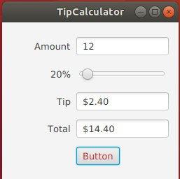

# simple-tip-calculator
// I have used slider, textFields and Button. Once it gets the percentage from the slider and the amount, it will generate the total 
Author: Burulsun Taalaibekova

There is an images file where I have uploaded the screenshots which you may check out.

Initial state:

Assign the values to the required fields:

Change tip percentage via slider:

Change the amount value as well as the tip percetage value:

